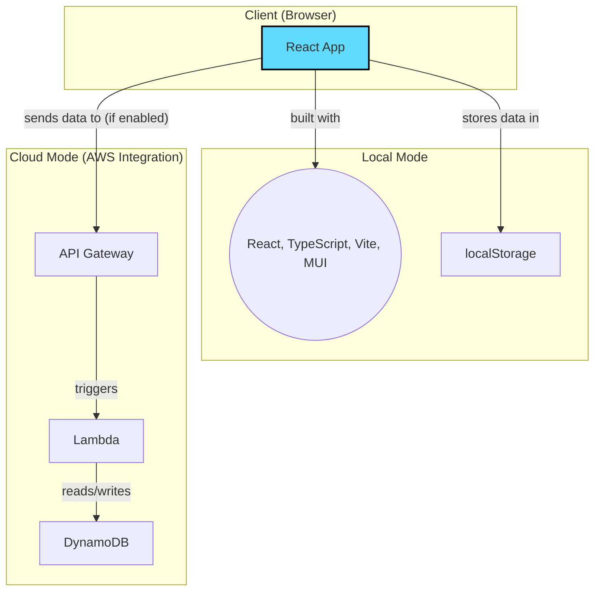

# Redirect URI Inspector

The Redirect URI Inspector is a client-side web application designed to help developers inspect and understand the data passed to a page via its URL. This is particularly useful when working with OAuth 2.0 flows, SAML assertions, or any scenario where a page acts as a redirect target and needs to process query parameters or URL fragments.

The project uses a **Unified Codebase** across all branches. Environment-specific behaviors (such as saving inspection logs to an AWS backend vs. keeping them entirely local) are controlled dynamically using environment configuration files rather than diverging codebases.

-----

## Demo

You can see screen recordings and screenshots of the app [here](https://brandonlc2020.github.io/Portfolio/project/3).

-----

## Features

* **URL Parsing:** Displays the full URL, a list of query parameters, and the URL fragment for inspected URIs.
* **Base64 Decoding Utility:** Automatically detects valid Base64-encoded strings (such as standard and URL-safe formats) in parameters or fragment inputs, provides an inline **Decode** toggle with collapsible visual transitions, prettifies JSON/XML payloads, and allows copying the decoded results directly.
* **Automated Inspection:**
    * By default, inspects the application's own `window.location.href` when it loads or changes.
    * **Configurable Default Monitored URL:** Users can set a persistent "default monitored URL". If set, and the application is opened without its own query parameters or fragment, this default URL will be inspected instead.
* **Manual URL Inspection:** Allows users to input any URL directly into the application for immediate parsing and addition to the history.
* **History Tracking:**
    * **Local Environment:** Stores a history of unique redirect entries purely in `localStorage`.
    * **AWS / Cloud Environment:** Stores history in `localStorage` and also asynchronously saves each entry to a DynamoDB table in AWS for persistent, centralized logging.
* **Reverse Chronological Order:** Shows the most recent entry at the top.
* **Clear History:** Option to clear all stored redirect history from `localStorage`.
* **Copy to Clipboard:** Copy full URL, auto-inspected URI, query params (as formatted JSON), or URL fragment.
* **Responsive Design:** Adapts to various screen sizes for easy viewing on desktop and mobile.

-----

## How it Works

### Client-Side (Core Architecture)

When the page is loaded or its own URL changes:

1. The application determines the URL to inspect:
    * It checks `window.location.href`.
    * If `window.location.href` has significant query parameters or a fragment, this URL is chosen.
    * If `window.location.href` is "plain" (no query/fragment) AND a default custom URL has been set by the user, that custom URL is inspected instead.
2. The chosen URL is parsed: its query string is broken into key-value pairs, and its fragment is extracted.
3. A new entry containing this data, along with a timestamp, is created.
4. The entry is saved to `localStorage` and the history is displayed in reverse chronological order.
5. Redundant logging is avoided by only adding a new record if its content differs from the most recently logged entry.

### Environment-Driven Backend Integration

The app uses standard Vite environment configuration files (`.env.*`) to control whether it interacts with a cloud backend:

* **Local Development (`.env.development`)**: Cloud saving is disabled (`VITE_SAVE_TO_CLOUD="false"`). All history is logged and persisted strictly on the client side.
* **Production AWS Hosting (`.env.production`)**: Cloud saving is enabled (`VITE_SAVE_TO_CLOUD="true"`), referencing the production AWS API Gateway Invoke URL (`VITE_API_ENDPOINT`).
    * **AWS Lambda & DynamoDB**: When cloud saving is active, the app sends the new `RedirectData` object to the API Gateway endpoint, which triggers a Lambda function (`lambda-redirect-handler.ts`) to validate and store the entry in a DynamoDB table.

-----

## Tech Stack

The diagram below illustrates the architecture of the unified codebase and its optional serverless backend.



* **Frontend:**
    * **React 18**
    * **Vite** (with built-in environment configurations)
    * **TypeScript** (with custom Vite type references)
    * **Material-UI (MUI):** For modern layouts, micro-animations, and styled components.
* **Backend (AWS Infrastructure):**
    * **AWS Lambda:** For serverless compute.
    * **AWS API Gateway:** To create a RESTful API endpoint for the Lambda function.
    * **AWS DynamoDB:** As the NoSQL database for storing redirect history.
    * **AWS SDK for JavaScript v3:** Used in the Lambda function to interact with DynamoDB.

-----

## Environment Variables Configuration

The application checks shared, non-secret environment configurations into Git. You can create local override configurations if needed.

* **`.env.development`** (Local instances):
  ```env
  VITE_API_ENDPOINT=""
  VITE_SAVE_TO_CLOUD="false"
  ```
* **`.env.production`** (Production hosted instances):
  ```env
  VITE_API_ENDPOINT="https://5wi9wpujda.execute-api.us-east-2.amazonaws.com/prod/redirects"
  VITE_SAVE_TO_CLOUD="true"
  ```

> [!NOTE]
> If you want to customize these variables locally without editing tracked files, you can create a `.env.development.local` file. It is automatically ignored by Git.

-----

## How to Run Locally

To run this application on your local machine, you'll need Node.js and npm installed.

1. **Clone the repository:**
   ```bash
   git clone <repository-url>
   cd PersonalRedirectInspectorWebApp
   ```

2. **Install dependencies:**
   ```bash
   npm install
   ```

3. **Run the development server:**
   ```bash
   npm run dev
   ```

4. **View the App:**
   Open your browser and navigate to the URL provided by Vite (e.g., `http://localhost:5173/`).

-----

## How to Use

1. **Automatic Inspection (as Redirect Target):**
    * Navigate to the application's URL in your browser.
    * To test its functionality as a redirect target, append query parameters and a URL fragment to its URL. For example: `http://localhost:5173/?name=JohnDoe&status=active#profileDetails`
    * The application will display the full URL, the parsed query parameters, and the fragment. This visit will be logged.

2. **Inspect and Decode Base64 Data:**
    * If a query parameter or URL fragment is a valid Base64-encoded string, the app will automatically display a **Base64** badge next to it.
    * Click the **Decode** button to toggle a collapsible, syntax-prettified inspector showing the decoded payload (with auto-formatting for JSON and XML content).
    * Use the **Copy Decoded** button inside the inspector to copy the clean, decoded text to your clipboard.

3. **Set/Clear Default Monitored URL:**
    * In the header, find the "Set Default Monitored URL" section.
    * Enter a complete URL and click "Set as Default".
    * If a default URL is set, and you open the Redirect Inspector without any query parameters or hash in its own URL, it will automatically inspect your specified default URL.

4. **Manually Inspect a Specific URL:**
    * In the header, find the "Manually Inspect Specific URL" section.
    * Enter any full URL you wish to examine and click "Inspect URL".

5. **Viewing History:**
    * All inspected entries appear in the history list below the header. The most recent entry is at the top.

6. **Using "Copy" Buttons:**
    * Each data block has a "Copy" button to easily copy the respective raw data to your clipboard.

7. **Clearing History:**
    * Use the "Clear History" button in the header to remove all logged entries from `localStorage`. **Note:** In Cloud Mode, this does *not* delete entries from DynamoDB.

-----

## License

This project is licensed under the MIT License.
